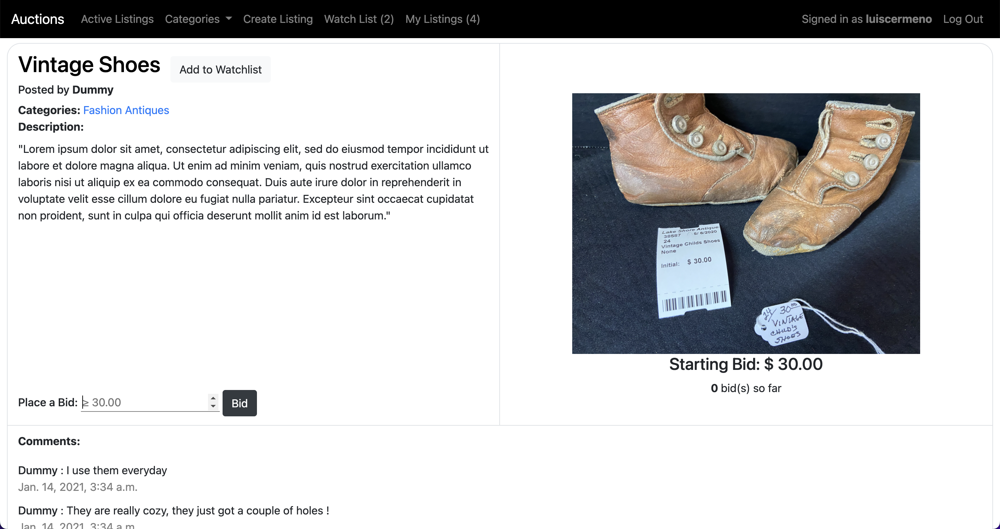
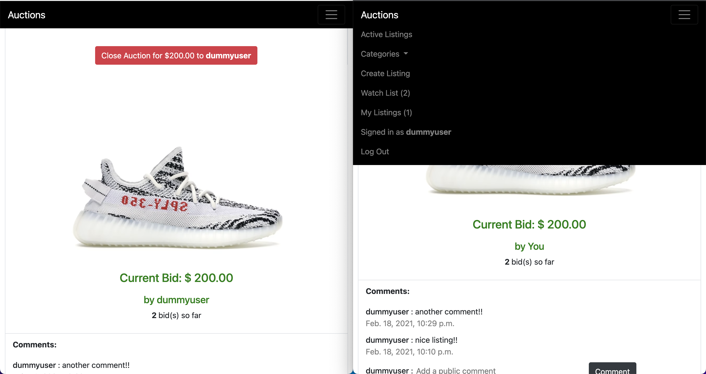

# Auctions.com

Auctions.com is based on e-Bay.com. Users can browse through a variety of listings in the main page; they can comment and/or bid on a listing. The owner of the listing decides wheter to close the auction to the highest bid. An interactive watchlist is also available. For future updates, I plan to implement a secured payment system.

